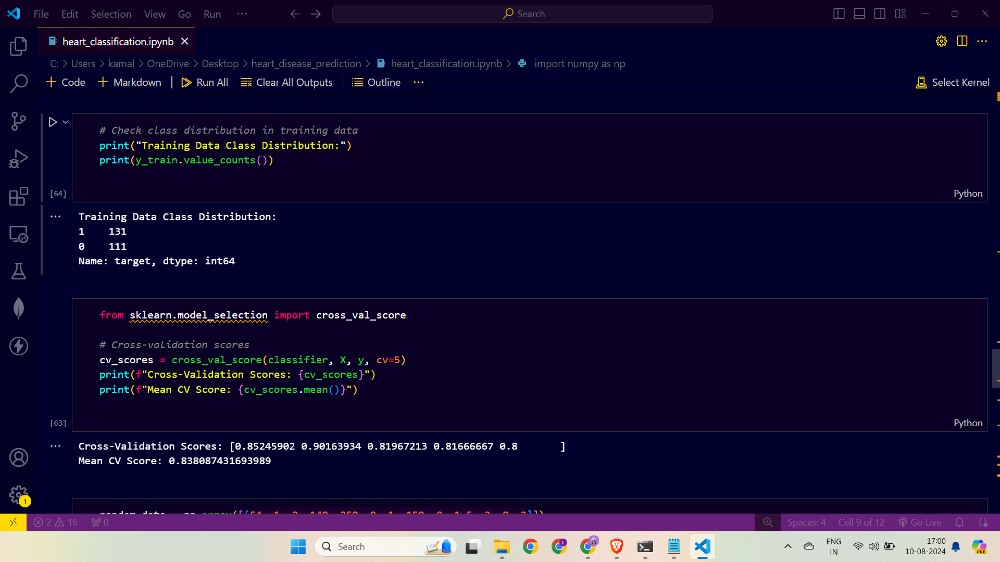

# Heart Disease Prediction with Random Forests

## Project Overview

This project focuses on predicting the likelihood of heart disease in patients using machine learning. After trying various algorithms like Linear Regression, Support Vector Machines (with linear, polynomial, and RBF kernels), and K-Nearest Neighbors (KNN), the Random Forest classifier provided the best accuracy at 89%. This project demonstrates how data preprocessing, feature engineering, and dimensionality reduction techniques can enhance predictive models. The model is deployed using Flask, offering a web interface for real-time predictions.

## Folder Structure

- **`app.py`**: The main Flask application file that manages routing, prediction logic, and rendering the web pages.
- **`heart.csv`**: The dataset containing patient records and target labels, indicating the presence of heart disease.
- **`heart_classification.ipynb`**: A Jupyter notebook that includes exploratory data analysis, feature engineering, model training, and evaluation.
- **`model.pkl`**: The serialized Random Forest model trained on the dataset.
- **`scaler.pkl`**: The serialized StandardScaler used to scale the input features.
- **`model.py`**: A Python script to train the model, incorporating feature engineering and PCA, and save the trained model and scaler.
- **`templates/`**: A directory containing the HTML template files used for the web interface.

## Prerequisites

Make sure you have Python installed along with the necessary libraries. You can install the required packages by running:

```bash
pip install -r requirements.txt
```

The `requirements.txt` file should include:

```
Flask
pandas
numpy
scikit-learn
joblib
```

## Dataset

The dataset (`heart.csv`) contains medical information from patients, including:

- **Age**
- **Sex**
- **Chest Pain Type (cp)**
- **Resting Blood Pressure (trestbps)**
- **Cholesterol (chol)**
- **Fasting Blood Sugar (fbs)**
- **Resting ECG (restecg)**
- **Max Heart Rate Achieved (thalach)**
- **Exercise Induced Angina (exang)**
- **ST Depression Induced by Exercise (oldpeak)**
- **Slope of the Peak Exercise ST Segment (slope)**
- **Number of Major Vessels Colored by Fluoroscopy (ca)**
- **Thalassemia (thal)**

The target variable (`target`) indicates whether the patient has heart disease (1) or not (0).

## Data Preprocessing and Feature Engineering

Before training the model, several preprocessing and feature engineering steps were performed to improve model accuracy:

1. **Handling Missing Values**: The dataset was checked for missing values, and appropriate imputation techniques were applied where necessary.

2. **Encoding Categorical Variables**: Categorical variables like `sex`, `cp`, `restecg`, `slope`, and `thal` were encoded using one-hot encoding to convert them into numerical format.

3. **Feature Scaling**: The features were scaled using `StandardScaler` to standardize the range of the data, which is crucial for algorithms like Random Forests.

4. **Feature Selection**: Feature selection techniques were used to identify and retain the most relevant features for predicting heart disease, reducing noise and potential overfitting.

5. **Dimensionality Reduction with PCA**: Principal Component Analysis (PCA) was applied to reduce the dimensionality of the feature space while retaining the variance in the data. This helped in improving the model's performance by focusing on the most significant components.

## Model Training Script (`model.py`)

The `model.py` script is responsible for handling the data preprocessing, feature engineering, model training, and saving the trained model and scaler for future use in the web application. Here's a breakdown of what happens in this script:

### Steps Performed in `model.py`:

1. **Loading the Dataset**:
   - The script begins by loading the heart disease dataset from `heart.csv`. This dataset contains the features and target variable that will be used for training the model.

2. **Data Preprocessing**:
   - **Handling Missing Values**: The script checks for any missing values in the dataset and applies necessary imputation techniques. This ensures that the dataset is clean and ready for analysis.
   - **Encoding Categorical Variables**: Categorical variables such as `sex`, `cp`, `restecg`, `slope`, and `thal` are encoded using one-hot encoding. This converts them into a format that can be understood by machine learning algorithms.

3. **Feature Engineering**:
   - **Feature Scaling**: The features are scaled using `StandardScaler` to ensure that they are on a similar scale. This is important for algorithms like Random Forests, which can be sensitive to the range of input features.
   - **Feature Selection**: The script applies feature selection techniques to identify the most relevant features for predicting heart disease. This helps in reducing the complexity of the model and improves its performance.
   - **Dimensionality Reduction (PCA)**: Principal Component Analysis (PCA) is performed to reduce the dimensionality of the feature space. This technique helps in retaining the most significant components while reducing noise and potential overfitting.

4. **Model Training**:
   - **Train-Test Split**: The dataset is split into training and testing sets (70% training, 30% testing) to evaluate the model's performance on unseen data.
   - **Random Forest Classifier**: The script defines a `RandomForestClassifier` with 100 estimators and a fixed random state for reproducibility. The model is then trained on the scaled and preprocessed training data.
   - **Hyperparameter Tuning**: The script may include hyperparameter tuning to optimize the performance of the Random Forest model. Techniques such as Grid Search or Random Search can be employed to find the best set of parameters.

5. **Model Evaluation**:
   - The trained model is evaluated on the testing set to assess its accuracy and generalization ability. The script may include additional evaluation metrics such as precision, recall, and F1-score to provide a more comprehensive assessment of the model's performance.

6. **Saving the Model and Scaler**:
   - After the model has been trained and evaluated, the `RandomForestClassifier` and `StandardScaler` are serialized and saved as `model.pkl` and `scaler.pkl`, respectively. These files are essential for deploying the model in the Flask web application.

### Running `model.py`:

To train the model and generate the necessary files for the web application, simply run the `model.py` script:

```bash
python model.py
```

This will output the trained model and scaler, which will be used in `app.py` to make predictions based on user input.

## Web Application

The web application is built using Flask,and styled with Bootstrap to ensure responsiveness across different devices, providing a user-friendly interface  where users can input patient data to predict the likelihood of heart disease. The application loads the pre-trained model and scaler to process the input and display the prediction.

### Routes

- `/`: The home page, displaying the input form.
- `/predict`: The endpoint that handles form submissions, processes the input, and returns the prediction.

### Running the Application

To run the web application, execute:

```bash
python app.py
```

Visit `http://127.0.0.1:5000/` in your browser to access the application.

## Example Usage

1. Navigate to the home page.
2. Fill in the patient details (age, sex, chest pain type, etc.).
3. Submit the form to receive a prediction of whether the patient is likely to have heart disease.

## Results and Conclusion

The Random Forest classifier provided the highest accuracy at 89%, making it the most effective model for this task. By applying feature engineering, PCA, and careful model selection, we enhanced the prediction accuracy, demonstrating the importance of preprocessing and algorithm selection in machine learning projects.


This combined README file includes all the relevant details about the project, from the overall structure and purpose to the specific scripts and their functionalities.
## Working of model





